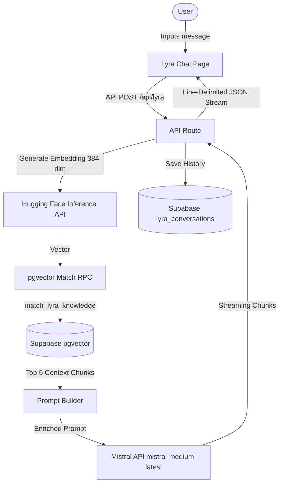

# Pulse AI

[](LICENSE)
[](https://nextjs.org/)
[](https://supabase.com/)
[](https://mistral.ai/)

An enterprise-grade, AI-powered health intelligence platform tailored for West Africa. Pulse AI offers automated symptom diagnosis, hospital recommendation algorithms sorted by real-time distance metrics, and a mental health virtual therapist (Lyra) integrated with a Retrieval-Augmented Generation (RAG) vector database.

---

## 🌟 Core Features

- **AI Symptom Diagnosis**: Analyzes user symptoms (via text or speech using Groq/Whisper) to estimate clinical severity and triage level.
- **Dynamic Hospital Proximity Engine**: Computes exact GPS/Haversine distances to healthcare facilities across West African countries (Togo, Niger, Mali, Côte d'Ivoire, Ghana, Burkina Faso, Benin), sorting recommendations dynamically.
- **Lyra Mental Health RAG Therapist**: A compassionate, culturally sensitive virtual therapist powered by Mistral AI, utilizing Supabase pgvector with Hugging Face embeddings to fetch local mental wellness guidance.
- **Medication Scanner**: Integrates computer vision models to identify prescribed medications and explain dosages in simplified language.

---

## 🗺️ Project Architecture & Flow



---

## 📁 Repository Structure

```text
├── Hospital_Data/          # GeoJSON hospital data files (Togo, Niger, Mali, Côte d'Ivoire, etc.)
├── app/
│   ├── (app)/              # Application pages (home, diagnostic, hospitals, lyra, profile)
│   └── api/                # Next.js API Routes (auth, hospitals, lyra, scan, diagnose)
├── components/             # Reusable UI React components (hospitals, lyra, layouts)
├── lib/
│   ├── hospitals/          # Hospital distance search and loader logic
│   ├── prompts/            # Prompts templates (system prompts for diagnosis, Lyra, etc.)
│   ├── rag/                # Embeddings, vector retrieval, and auto-seeding scripts
│   ├── services/           # Backend fetchers and helpers
│   └── supabase/           # Supabase client & server initialization
├── styles/                 # Tailwind design tokens and CSS config
├── types/                  # Shared TypeScript interfaces
├── LICENSE                 # License of the project (MIT)
└── package.json            # NPM dependencies and scripts
```

---

## ⚙️ Environment Configuration

Create a `.env.local` file at the root containing the following variables:

| Variable | Description |
| :--- | :--- |
| `MISTRAL_API_KEY` | Mistral API authentication key for chat completion |
| `HUGGINGFACE_API_KEY` | Hugging Face token for `sentence-transformers/all-MiniLM-L6-v2` |
| `NEXT_PUBLIC_SUPABASE_URL` | Base URL of your Supabase instance |
| `NEXT_PUBLIC_SUPABASE_ANON_KEY`| Supabase public anonymous access key |
| `SUPABASE_SERVICE_ROLE_KEY` | Supabase Service Role key (bypass RLS for retrieval/seeding) |
| `GROQ_API_KEY` | Groq API key for diagnosis and audio transcription |

---

## 🗄️ Database Schemas (Supabase SQL)

Ensure pgvector is enabled, and execute the following SQL to configure RAG knowledge tables and user conversation persistence:

```sql
-- Enable vector extension
CREATE EXTENSION IF NOT EXISTS vector;

-- Lyra RAG Vector Database Table
CREATE TABLE IF NOT EXISTS lyra_knowledge (
  id UUID DEFAULT gen_random_uuid() PRIMARY KEY,
  content TEXT NOT NULL,
  source VARCHAR(255),
  category VARCHAR(100),
  embedding vector(384),
  created_at TIMESTAMPTZ DEFAULT NOW()
);

-- User Conversation History Table
CREATE TABLE IF NOT EXISTS lyra_conversations (
  id UUID DEFAULT gen_random_uuid() PRIMARY KEY,
  user_id UUID REFERENCES auth.users(id) ON DELETE CASCADE UNIQUE,
  messages JSONB NOT NULL DEFAULT '[]',
  updated_at TIMESTAMPTZ DEFAULT NOW()
);

-- Enable RLS and setup policies
ALTER TABLE lyra_conversations ENABLE ROW LEVEL SECURITY;

CREATE POLICY "Users can manage their own conversations" 
  ON lyra_conversations 
  FOR ALL 
  USING (auth.uid() = user_id);

-- pgvector Cosine Distance Matching Function
CREATE OR REPLACE FUNCTION match_lyra_knowledge(
  query_embedding vector(384), 
  match_threshold FLOAT, 
  match_count INT
) RETURNS TABLE (
  id UUID, 
  content TEXT, 
  source VARCHAR, 
  similarity FLOAT
)
LANGUAGE SQL STABLE AS $$
  SELECT 
    id, 
    content, 
    source, 
    1 - (embedding <=> query_embedding) AS similarity
  FROM lyra_knowledge
  WHERE 1 - (embedding <=> query_embedding) > match_threshold
  ORDER BY embedding <=> query_embedding 
  LIMIT match_count;
$$;
```

---

## 🚀 Quick Start

1. **Install Dependencies**:
   ```bash
   npm install
   ```

2. **Boot Dev Server**:
   ```bash
   npm run dev
   ```

3. **Auto-Seeding**:
   The application automatically seeds the `lyra_knowledge` database with 10 high-quality, West African-focused mental health guidelines on the very first Lyra chat request if the table is empty.

---

## 📄 License

This project is licensed under the MIT License - see the [LICENSE](LICENSE) file for details.
